# Unified Public Portal - Database Schema

## Entity Relationship Diagram (Mermaid)

```mermaid
erDiagram
    USER ||--o{ ENTITY_ROLE : has
    USER ||--o{ SESSION : has
    USER ||--o{ NOTIFICATION_PREFERENCE : has
    USER ||--o{ PAYMENT_METHOD : owns
    USER ||--o{ AUDIT_LOG : generates
    
    ENTITY ||--o{ ENTITY_ROLE : has
    ENTITY ||--o{ ADDRESS : has
    ENTITY ||--o{ DOCUMENT : owns
    ENTITY ||--o{ BILL : receives
    ENTITY ||--o{ APPLICATION : submits
    ENTITY ||--o{ PAYMENT : makes
    
    ENTITY_ROLE }o--|| USER : assigned_to
    ENTITY_ROLE }o--|| ENTITY : for_entity
    
    HOUSEHOLD ||--|| ENTITY : extends
    BUSINESS ||--|| ENTITY : extends
    ORGANIZATION ||--|| ENTITY : extends
    SCHOOL ||--|| ENTITY : extends
    VENDOR ||--|| ENTITY : extends
    
    BILL ||--o{ BILL_LINE_ITEM : contains
    BILL ||--o{ PAYMENT : paid_by
    BILL }o--|| BILL_TYPE : categorized_as
    
    APPLICATION ||--o{ APPLICATION_DOCUMENT : requires
    APPLICATION ||--o{ WORKFLOW_TASK : generates
    APPLICATION }o--|| APPLICATION_TYPE : categorized_as
    
    WORKFLOW_TASK }o--|| USER : assigned_to
    WORKFLOW_TASK }o--|| APPLICATION : belongs_to
    
    PAYMENT ||--o{ PAYMENT_ALLOCATION : allocated_to
    PAYMENT }o--|| PAYMENT_METHOD : uses
    
    DOCUMENT ||--o{ DOCUMENT_VERSION : has
    DOCUMENT }o--|| DOCUMENT_TYPE : categorized_as
    
    NOTIFICATION ||--o{ NOTIFICATION_DELIVERY : sent_via
    NOTIFICATION }o--|| USER : sent_to

    USER {
        uuid id PK
        string email UK
        string phone
        string password_hash
        string first_name
        string last_name
        string preferred_language
        boolean mfa_enabled
        string mfa_secret
        timestamp email_verified_at
        timestamp phone_verified_at
        timestamp last_login_at
        timestamp created_at
        timestamp updated_at
    }
    
    ENTITY {
        uuid id PK
        string entity_type
        string display_name
        string status
        jsonb metadata
        timestamp created_at
        timestamp updated_at
    }
    
    ENTITY_ROLE {
        uuid id PK
        uuid user_id FK
        uuid entity_id FK
        string role_type
        jsonb permissions
        uuid delegated_by FK
        timestamp valid_from
        timestamp valid_until
        timestamp created_at
    }
    
    HOUSEHOLD {
        uuid id PK
        uuid entity_id FK
        integer member_count
        string household_type
        boolean is_senior
        boolean is_veteran
        decimal income_bracket
    }
    
    BUSINESS {
        uuid id PK
        uuid entity_id FK
        string ein
        string business_name
        string dba_name
        string business_type
        string license_number
        date license_expiry
        string naics_code
        integer employee_count
    }
    
    ORGANIZATION {
        uuid id PK
        uuid entity_id FK
        string ein
        string org_name
        string org_type
        string c501_type
        string mission_statement
        date tax_exempt_since
    }
    
    SCHOOL {
        uuid id PK
        uuid entity_id FK
        string school_name
        string district_id
        string school_type
        string grade_levels
        integer enrollment
        string principal_name
    }
    
    VENDOR {
        uuid id PK
        uuid entity_id FK
        string vendor_number
        string vendor_name
        string vendor_type
        jsonb certifications
        string payment_terms
        boolean is_active
        date registered_since
    }
    
    ADDRESS {
        uuid id PK
        uuid entity_id FK
        string address_type
        string street_line_1
        string street_line_2
        string city
        string state
        string postal_code
        string country
        string parcel_id
        point geo_location
        boolean is_primary
    }
    
    BILL_TYPE {
        uuid id PK
        string code UK
        string name
        string category
        string department
        jsonb fee_structure
        boolean is_active
    }
    
    BILL {
        uuid id PK
        uuid entity_id FK
        uuid bill_type_id FK
        string bill_number UK
        string status
        date bill_date
        date due_date
        decimal total_amount
        decimal amount_paid
        decimal amount_due
        string period_start
        string period_end
        jsonb metadata
        timestamp created_at
    }
    
    BILL_LINE_ITEM {
        uuid id PK
        uuid bill_id FK
        string description
        decimal quantity
        decimal unit_price
        decimal amount
        string gl_code
    }
    
    APPLICATION_TYPE {
        uuid id PK
        string code UK
        string name
        string category
        string department
        jsonb required_documents
        jsonb workflow_definition
        decimal base_fee
        integer estimated_days
        boolean is_active
    }
    
    APPLICATION {
        uuid id PK
        uuid entity_id FK
        uuid submitted_by FK
        uuid application_type_id FK
        string application_number UK
        string status
        jsonb form_data
        decimal fee_amount
        decimal fee_paid
        timestamp submitted_at
        timestamp approved_at
        timestamp expires_at
        timestamp created_at
    }
    
    APPLICATION_DOCUMENT {
        uuid id PK
        uuid application_id FK
        uuid document_id FK
        string requirement_type
        string status
        string notes
    }
    
    WORKFLOW_TASK {
        uuid id PK
        uuid application_id FK
        uuid assigned_to FK
        string task_type
        string status
        string priority
        jsonb task_data
        timestamp due_date
        timestamp completed_at
        timestamp created_at
    }
    
    PAYMENT_METHOD {
        uuid id PK
        uuid user_id FK
        string method_type
        string nickname
        string last_four
        string brand
        string processor_token
        date expiry_date
        boolean is_default
        boolean is_autopay
        timestamp created_at
    }
    
    PAYMENT {
        uuid id PK
        uuid entity_id FK
        uuid user_id FK
        uuid payment_method_id FK
        string payment_number UK
        string status
        decimal amount
        decimal fee_amount
        string processor_reference
        string processor_status
        jsonb processor_response
        timestamp processed_at
        timestamp created_at
    }
    
    PAYMENT_ALLOCATION {
        uuid id PK
        uuid payment_id FK
        uuid bill_id FK
        decimal amount
        timestamp created_at
    }
    
    DOCUMENT_TYPE {
        uuid id PK
        string code UK
        string name
        string category
        integer retention_days
        boolean requires_expiry
    }
    
    DOCUMENT {
        uuid id PK
        uuid entity_id FK
        uuid uploaded_by FK
        uuid document_type_id FK
        string filename
        string mime_type
        integer file_size
        string storage_path
        string status
        date expiry_date
        jsonb metadata
        timestamp created_at
    }
    
    DOCUMENT_VERSION {
        uuid id PK
        uuid document_id FK
        integer version_number
        string storage_path
        string uploaded_by FK
        timestamp created_at
    }
    
    NOTIFICATION_PREFERENCE {
        uuid id PK
        uuid user_id FK
        string notification_type
        boolean email_enabled
        boolean sms_enabled
        boolean push_enabled
        boolean in_app_enabled
        jsonb settings
    }
    
    NOTIFICATION {
        uuid id PK
        uuid user_id FK
        string notification_type
        string subject
        text body
        jsonb data
        string status
        timestamp read_at
        timestamp created_at
    }
    
    NOTIFICATION_DELIVERY {
        uuid id PK
        uuid notification_id FK
        string channel
        string status
        string external_id
        jsonb response
        timestamp sent_at
        timestamp delivered_at
    }
    
    SESSION {
        uuid id PK
        uuid user_id FK
        string token_hash
        string ip_address
        string user_agent
        timestamp expires_at
        timestamp created_at
    }
    
    AUDIT_LOG {
        uuid id PK
        uuid user_id FK
        uuid entity_id FK
        string action
        string resource_type
        uuid resource_id
        jsonb old_values
        jsonb new_values
        string ip_address
        timestamp created_at
    }
```



---

## SQL Schema

```sql
-- ============================================
-- UNIFIED PUBLIC PORTAL DATABASE SCHEMA
-- PostgreSQL 15+
-- ============================================

-- Enable extensions
CREATE EXTENSION IF NOT EXISTS "uuid-ossp";
CREATE EXTENSION IF NOT EXISTS "postgis";
CREATE EXTENSION IF NOT EXISTS "pg_trgm";

-- ============================================
-- ENUMS
-- ============================================

CREATE TYPE entity_type AS ENUM (
    'household', 'business', 'organization', 'school', 'vendor'
);

CREATE TYPE entity_status AS ENUM (
    'active', 'inactive', 'suspended', 'pending_verification'
);

CREATE TYPE role_type AS ENUM (
    'owner', 'admin', 'member', 'delegate', 'viewer'
);

CREATE TYPE bill_status AS ENUM (
    'draft', 'issued', 'due', 'overdue', 'paid', 'partial', 'cancelled', 'refunded'
);

CREATE TYPE bill_category AS ENUM (
    'utility', 'permit', 'license', 'property_tax', 'business_tax', 
    'sales_tax', 'assessment', 'grant', 'vendor', 'parks', 'misc'
);

CREATE TYPE application_status AS ENUM (
    'draft', 'submitted', 'under_review', 'pending_info', 'pending_payment',
    'pending_inspection', 'approved', 'denied', 'withdrawn', 'expired'
);

CREATE TYPE payment_status AS ENUM (
    'pending', 'processing', 'completed', 'failed', 'refunded', 'cancelled'
);

CREATE TYPE payment_method_type AS ENUM (
    'credit_card', 'debit_card', 'ach', 'apple_pay', 'google_pay', 'check', 'cash'
);

CREATE TYPE document_status AS ENUM (
    'pending', 'verified', 'rejected', 'expired'
);

CREATE TYPE task_status AS ENUM (
    'pending', 'assigned', 'in_progress', 'completed', 'cancelled'
);

CREATE TYPE notification_channel AS ENUM (
    'email', 'sms', 'push', 'in_app'
);

-- ============================================
-- CORE TABLES
-- ============================================

-- Users (Identity)
CREATE TABLE users (
    id UUID PRIMARY KEY DEFAULT uuid_generate_v4(),
    email VARCHAR(255) UNIQUE NOT NULL,
    phone VARCHAR(20),
    password_hash VARCHAR(255) NOT NULL,
    first_name VARCHAR(100) NOT NULL,
    last_name VARCHAR(100) NOT NULL,
    preferred_language VARCHAR(10) DEFAULT 'en',
    mfa_enabled BOOLEAN DEFAULT FALSE,
    mfa_secret VARCHAR(255),
    email_verified_at TIMESTAMPTZ,
    phone_verified_at TIMESTAMPTZ,
    last_login_at TIMESTAMPTZ,
    failed_login_attempts INTEGER DEFAULT 0,
    locked_until TIMESTAMPTZ,
    created_at TIMESTAMPTZ DEFAULT NOW(),
    updated_at TIMESTAMPTZ DEFAULT NOW()
);

CREATE INDEX idx_users_email ON users(email);
CREATE INDEX idx_users_phone ON users(phone);

-- Entities (Polymorphic base for all entity types)
CREATE TABLE entities (
    id UUID PRIMARY KEY DEFAULT uuid_generate_v4(),
    entity_type entity_type NOT NULL,
    display_name VARCHAR(255) NOT NULL,
    status entity_status DEFAULT 'pending_verification',
    metadata JSONB DEFAULT '{}',
    created_at TIMESTAMPTZ DEFAULT NOW(),
    updated_at TIMESTAMPTZ DEFAULT NOW()
);

CREATE INDEX idx_entities_type ON entities(entity_type);
CREATE INDEX idx_entities_status ON entities(status);

-- Entity Roles (User-Entity relationship with permissions)
CREATE TABLE entity_roles (
    id UUID PRIMARY KEY DEFAULT uuid_generate_v4(),
    user_id UUID NOT NULL REFERENCES users(id) ON DELETE CASCADE,
    entity_id UUID NOT NULL REFERENCES entities(id) ON DELETE CASCADE,
    role_type role_type NOT NULL,
    permissions JSONB DEFAULT '{}',
    delegated_by UUID REFERENCES users(id),
    valid_from TIMESTAMPTZ DEFAULT NOW(),
    valid_until TIMESTAMPTZ,
    created_at TIMESTAMPTZ DEFAULT NOW(),
    UNIQUE(user_id, entity_id)
);

CREATE INDEX idx_entity_roles_user ON entity_roles(user_id);
CREATE INDEX idx_entity_roles_entity ON entity_roles(entity_id);

-- ============================================
-- ENTITY TYPE TABLES
-- ============================================

-- Households
CREATE TABLE households (
    id UUID PRIMARY KEY DEFAULT uuid_generate_v4(),
    entity_id UUID UNIQUE NOT NULL REFERENCES entities(id) ON DELETE CASCADE,
    member_count INTEGER DEFAULT 1,
    household_type VARCHAR(50),
    is_senior BOOLEAN DEFAULT FALSE,
    is_veteran BOOLEAN DEFAULT FALSE,
    income_bracket VARCHAR(20),
    created_at TIMESTAMPTZ DEFAULT NOW()
);

-- Businesses
CREATE TABLE businesses (
    id UUID PRIMARY KEY DEFAULT uuid_generate_v4(),
    entity_id UUID UNIQUE NOT NULL REFERENCES entities(id) ON DELETE CASCADE,
    ein VARCHAR(20),
    business_name VARCHAR(255) NOT NULL,
    dba_name VARCHAR(255),
    business_type VARCHAR(100),
    license_number VARCHAR(50),
    license_expiry DATE,
    naics_code VARCHAR(10),
    employee_count INTEGER,
    created_at TIMESTAMPTZ DEFAULT NOW()
);

CREATE INDEX idx_businesses_ein ON businesses(ein);
CREATE INDEX idx_businesses_license ON businesses(license_number);

-- Organizations (Nonprofits)
CREATE TABLE organizations (
    id UUID PRIMARY KEY DEFAULT uuid_generate_v4(),
    entity_id UUID UNIQUE NOT NULL REFERENCES entities(id) ON DELETE CASCADE,
    ein VARCHAR(20),
    org_name VARCHAR(255) NOT NULL,
    org_type VARCHAR(100),
    c501_type VARCHAR(20),
    mission_statement TEXT,
    tax_exempt_since DATE,
    created_at TIMESTAMPTZ DEFAULT NOW()
);

-- Schools
CREATE TABLE schools (
    id UUID PRIMARY KEY DEFAULT uuid_generate_v4(),
    entity_id UUID UNIQUE NOT NULL REFERENCES entities(id) ON DELETE CASCADE,
    school_name VARCHAR(255) NOT NULL,
    district_id VARCHAR(50),
    school_type VARCHAR(50),
    grade_levels VARCHAR(50),
    enrollment INTEGER,
    principal_name VARCHAR(200),
    created_at TIMESTAMPTZ DEFAULT NOW()
);

-- Vendors
CREATE TABLE vendors (
    id UUID PRIMARY KEY DEFAULT uuid_generate_v4(),
    entity_id UUID UNIQUE NOT NULL REFERENCES entities(id) ON DELETE CASCADE,
    vendor_number VARCHAR(50) UNIQUE NOT NULL,
    vendor_name VARCHAR(255) NOT NULL,
    vendor_type VARCHAR(100),
    certifications JSONB DEFAULT '[]',
    payment_terms VARCHAR(50),
    is_active BOOLEAN DEFAULT TRUE,
    registered_since DATE,
    created_at TIMESTAMPTZ DEFAULT NOW()
);

CREATE INDEX idx_vendors_number ON vendors(vendor_number);

-- ============================================
-- ADDRESS TABLE
-- ============================================

CREATE TABLE addresses (
    id UUID PRIMARY KEY DEFAULT uuid_generate_v4(),
    entity_id UUID NOT NULL REFERENCES entities(id) ON DELETE CASCADE,
    address_type VARCHAR(50) DEFAULT 'primary',
    street_line_1 VARCHAR(255) NOT NULL,
    street_line_2 VARCHAR(255),
    city VARCHAR(100) NOT NULL,
    state VARCHAR(50) NOT NULL,
    postal_code VARCHAR(20) NOT NULL,
    country VARCHAR(50) DEFAULT 'USA',
    parcel_id VARCHAR(50),
    geo_location GEOGRAPHY(POINT, 4326),
    is_primary BOOLEAN DEFAULT FALSE,
    verified_at TIMESTAMPTZ,
    created_at TIMESTAMPTZ DEFAULT NOW()
);

CREATE INDEX idx_addresses_entity ON addresses(entity_id);
CREATE INDEX idx_addresses_parcel ON addresses(parcel_id);
CREATE INDEX idx_addresses_geo ON addresses USING GIST(geo_location);

-- ============================================
-- BILLING TABLES
-- ============================================

-- Bill Types (Configuration)
CREATE TABLE bill_types (
    id UUID PRIMARY KEY DEFAULT uuid_generate_v4(),
    code VARCHAR(50) UNIQUE NOT NULL,
    name VARCHAR(255) NOT NULL,
    category bill_category NOT NULL,
    department VARCHAR(100),
    fee_structure JSONB DEFAULT '{}',
    gl_code VARCHAR(50),
    is_active BOOLEAN DEFAULT TRUE,
    created_at TIMESTAMPTZ DEFAULT NOW()
);

-- Bills
CREATE TABLE bills (
    id UUID PRIMARY KEY DEFAULT uuid_generate_v4(),
    entity_id UUID NOT NULL REFERENCES entities(id),
    bill_type_id UUID NOT NULL REFERENCES bill_types(id),
    bill_number VARCHAR(50) UNIQUE NOT NULL,
    status bill_status DEFAULT 'issued',
    bill_date DATE NOT NULL,
    due_date DATE NOT NULL,
    total_amount DECIMAL(12,2) NOT NULL,
    amount_paid DECIMAL(12,2) DEFAULT 0,
    amount_due DECIMAL(12,2) GENERATED ALWAYS AS (total_amount - amount_paid) STORED,
    period_start DATE,
    period_end DATE,
    metadata JSONB DEFAULT '{}',
    created_at TIMESTAMPTZ DEFAULT NOW(),
    updated_at TIMESTAMPTZ DEFAULT NOW()
);

CREATE INDEX idx_bills_entity ON bills(entity_id);
CREATE INDEX idx_bills_status ON bills(status);
CREATE INDEX idx_bills_due_date ON bills(due_date);
CREATE INDEX idx_bills_type ON bills(bill_type_id);

-- Bill Line Items
CREATE TABLE bill_line_items (
    id UUID PRIMARY KEY DEFAULT uuid_generate_v4(),
    bill_id UUID NOT NULL REFERENCES bills(id) ON DELETE CASCADE,
    description VARCHAR(500) NOT NULL,
    quantity DECIMAL(10,4) DEFAULT 1,
    unit_price DECIMAL(12,4) NOT NULL,
    amount DECIMAL(12,2) NOT NULL,
    gl_code VARCHAR(50),
    sort_order INTEGER DEFAULT 0,
    created_at TIMESTAMPTZ DEFAULT NOW()
);

CREATE INDEX idx_bill_line_items_bill ON bill_line_items(bill_id);

-- ============================================
-- APPLICATION/WORKFLOW TABLES
-- ============================================

-- Application Types (Configuration)
CREATE TABLE application_types (
    id UUID PRIMARY KEY DEFAULT uuid_generate_v4(),
    code VARCHAR(50) UNIQUE NOT NULL,
    name VARCHAR(255) NOT NULL,
    category VARCHAR(100) NOT NULL,
    department VARCHAR(100),
    required_documents JSONB DEFAULT '[]',
    workflow_definition JSONB DEFAULT '{}',
    base_fee DECIMAL(12,2) DEFAULT 0,
    estimated_days INTEGER DEFAULT 30,
    is_active BOOLEAN DEFAULT TRUE,
    created_at TIMESTAMPTZ DEFAULT NOW()
);

-- Applications
CREATE TABLE applications (
    id UUID PRIMARY KEY DEFAULT uuid_generate_v4(),
    entity_id UUID NOT NULL REFERENCES entities(id),
    submitted_by UUID NOT NULL REFERENCES users(id),
    application_type_id UUID NOT NULL REFERENCES application_types(id),
    application_number VARCHAR(50) UNIQUE NOT NULL,
    status application_status DEFAULT 'draft',
    form_data JSONB DEFAULT '{}',
    fee_amount DECIMAL(12,2) DEFAULT 0,
    fee_paid DECIMAL(12,2) DEFAULT 0,
    submitted_at TIMESTAMPTZ,
    approved_at TIMESTAMPTZ,
    expires_at TIMESTAMPTZ,
    created_at TIMESTAMPTZ DEFAULT NOW(),
    updated_at TIMESTAMPTZ DEFAULT NOW()
);

CREATE INDEX idx_applications_entity ON applications(entity_id);
CREATE INDEX idx_applications_status ON applications(status);
CREATE INDEX idx_applications_type ON applications(application_type_id);
CREATE INDEX idx_applications_submitted_by ON applications(submitted_by);

-- Workflow Tasks
CREATE TABLE workflow_tasks (
    id UUID PRIMARY KEY DEFAULT uuid_generate_v4(),
    application_id UUID NOT NULL REFERENCES applications(id) ON DELETE CASCADE,
    assigned_to UUID REFERENCES users(id),
    task_type VARCHAR(100) NOT NULL,
    status task_status DEFAULT 'pending',
    priority VARCHAR(20) DEFAULT 'normal',
    task_data JSONB DEFAULT '{}',
    due_date TIMESTAMPTZ,
    completed_at TIMESTAMPTZ,
    completed_by UUID REFERENCES users(id),
    notes TEXT,
    created_at TIMESTAMPTZ DEFAULT NOW()
);

CREATE INDEX idx_workflow_tasks_application ON workflow_tasks(application_id);
CREATE INDEX idx_workflow_tasks_assigned ON workflow_tasks(assigned_to);
CREATE INDEX idx_workflow_tasks_status ON workflow_tasks(status);

-- ============================================
-- PAYMENT TABLES
-- ============================================

-- Payment Methods
CREATE TABLE payment_methods (
    id UUID PRIMARY KEY DEFAULT uuid_generate_v4(),
    user_id UUID NOT NULL REFERENCES users(id) ON DELETE CASCADE,
    method_type payment_method_type NOT NULL,
    nickname VARCHAR(100),
    last_four VARCHAR(4),
    brand VARCHAR(50),
    processor_token VARCHAR(255),
    expiry_date DATE,
    is_default BOOLEAN DEFAULT FALSE,
    is_autopay BOOLEAN DEFAULT FALSE,
    created_at TIMESTAMPTZ DEFAULT NOW(),
    updated_at TIMESTAMPTZ DEFAULT NOW()
);

CREATE INDEX idx_payment_methods_user ON payment_methods(user_id);

-- Payments
CREATE TABLE payments (
    id UUID PRIMARY KEY DEFAULT uuid_generate_v4(),
    entity_id UUID NOT NULL REFERENCES entities(id),
    user_id UUID NOT NULL REFERENCES users(id),
    payment_method_id UUID REFERENCES payment_methods(id),
    payment_number VARCHAR(50) UNIQUE NOT NULL,
    status payment_status DEFAULT 'pending',
    amount DECIMAL(12,2) NOT NULL,
    fee_amount DECIMAL(12,2) DEFAULT 0,
    processor_reference VARCHAR(255),
    processor_status VARCHAR(50),
    processor_response JSONB,
    processed_at TIMESTAMPTZ,
    refunded_at TIMESTAMPTZ,
    created_at TIMESTAMPTZ DEFAULT NOW()
);

CREATE INDEX idx_payments_entity ON payments(entity_id);
CREATE INDEX idx_payments_user ON payments(user_id);
CREATE INDEX idx_payments_status ON payments(status);

-- Payment Allocations
CREATE TABLE payment_allocations (
    id UUID PRIMARY KEY DEFAULT uuid_generate_v4(),
    payment_id UUID NOT NULL REFERENCES payments(id) ON DELETE CASCADE,
    bill_id UUID NOT NULL REFERENCES bills(id),
    amount DECIMAL(12,2) NOT NULL,
    created_at TIMESTAMPTZ DEFAULT NOW()
);

CREATE INDEX idx_payment_allocations_payment ON payment_allocations(payment_id);
CREATE INDEX idx_payment_allocations_bill ON payment_allocations(bill_id);

-- ============================================
-- DOCUMENT TABLES
-- ============================================

-- Document Types
CREATE TABLE document_types (
    id UUID PRIMARY KEY DEFAULT uuid_generate_v4(),
    code VARCHAR(50) UNIQUE NOT NULL,
    name VARCHAR(255) NOT NULL,
    category VARCHAR(100),
    retention_days INTEGER DEFAULT 2555,
    requires_expiry BOOLEAN DEFAULT FALSE,
    is_active BOOLEAN DEFAULT TRUE,
    created_at TIMESTAMPTZ DEFAULT NOW()
);

-- Documents
CREATE TABLE documents (
    id UUID PRIMARY KEY DEFAULT uuid_generate_v4(),
    entity_id UUID NOT NULL REFERENCES entities(id),
    uploaded_by UUID NOT NULL REFERENCES users(id),
    document_type_id UUID REFERENCES document_types(id),
    filename VARCHAR(255) NOT NULL,
    original_filename VARCHAR(255) NOT NULL,
    mime_type VARCHAR(100) NOT NULL,
    file_size INTEGER NOT NULL,
    storage_path VARCHAR(500) NOT NULL,
    status document_status DEFAULT 'pending',
    expiry_date DATE,
    metadata JSONB DEFAULT '{}',
    created_at TIMESTAMPTZ DEFAULT NOW()
);

CREATE INDEX idx_documents_entity ON documents(entity_id);
CREATE INDEX idx_documents_type ON documents(document_type_id);
CREATE INDEX idx_documents_expiry ON documents(expiry_date);

-- Application Documents (Junction)
CREATE TABLE application_documents (
    id UUID PRIMARY KEY DEFAULT uuid_generate_v4(),
    application_id UUID NOT NULL REFERENCES applications(id) ON DELETE CASCADE,
    document_id UUID NOT NULL REFERENCES documents(id),
    requirement_type VARCHAR(100),
    status document_status DEFAULT 'pending',
    notes TEXT,
    created_at TIMESTAMPTZ DEFAULT NOW()
);

CREATE INDEX idx_application_documents_app ON application_documents(application_id);

-- ============================================
-- NOTIFICATION TABLES
-- ============================================

-- Notification Preferences
CREATE TABLE notification_preferences (
    id UUID PRIMARY KEY DEFAULT uuid_generate_v4(),
    user_id UUID NOT NULL REFERENCES users(id) ON DELETE CASCADE,
    notification_type VARCHAR(100) NOT NULL,
    email_enabled BOOLEAN DEFAULT TRUE,
    sms_enabled BOOLEAN DEFAULT FALSE,
    push_enabled BOOLEAN DEFAULT TRUE,
    in_app_enabled BOOLEAN DEFAULT TRUE,
    settings JSONB DEFAULT '{}',
    created_at TIMESTAMPTZ DEFAULT NOW(),
    UNIQUE(user_id, notification_type)
);

-- Notifications
CREATE TABLE notifications (
    id UUID PRIMARY KEY DEFAULT uuid_generate_v4(),
    user_id UUID NOT NULL REFERENCES users(id) ON DELETE CASCADE,
    notification_type VARCHAR(100) NOT NULL,
    subject VARCHAR(255) NOT NULL,
    body TEXT NOT NULL,
    data JSONB DEFAULT '{}',
    read_at TIMESTAMPTZ,
    created_at TIMESTAMPTZ DEFAULT NOW()
);

CREATE INDEX idx_notifications_user ON notifications(user_id);
CREATE INDEX idx_notifications_unread ON notifications(user_id) WHERE read_at IS NULL;

-- Notification Deliveries
CREATE TABLE notification_deliveries (
    id UUID PRIMARY KEY DEFAULT uuid_generate_v4(),
    notification_id UUID NOT NULL REFERENCES notifications(id) ON DELETE CASCADE,
    channel notification_channel NOT NULL,
    status VARCHAR(50) DEFAULT 'pending',
    external_id VARCHAR(255),
    response JSONB,
    sent_at TIMESTAMPTZ,
    delivered_at TIMESTAMPTZ,
    created_at TIMESTAMPTZ DEFAULT NOW()
);

CREATE INDEX idx_notification_deliveries_notification ON notification_deliveries(notification_id);

-- ============================================
-- SESSION & AUDIT TABLES
-- ============================================

-- Sessions
CREATE TABLE sessions (
    id UUID PRIMARY KEY DEFAULT uuid_generate_v4(),
    user_id UUID NOT NULL REFERENCES users(id) ON DELETE CASCADE,
    token_hash VARCHAR(255) NOT NULL,
    ip_address INET,
    user_agent TEXT,
    expires_at TIMESTAMPTZ NOT NULL,
    created_at TIMESTAMPTZ DEFAULT NOW()
);

CREATE INDEX idx_sessions_user ON sessions(user_id);
CREATE INDEX idx_sessions_token ON sessions(token_hash);

-- Audit Logs
CREATE TABLE audit_logs (
    id UUID PRIMARY KEY DEFAULT uuid_generate_v4(),
    user_id UUID REFERENCES users(id),
    entity_id UUID REFERENCES entities(id),
    action VARCHAR(100) NOT NULL,
    resource_type VARCHAR(100) NOT NULL,
    resource_id UUID,
    old_values JSONB,
    new_values JSONB,
    ip_address INET,
    user_agent TEXT,
    created_at TIMESTAMPTZ DEFAULT NOW()
);

CREATE INDEX idx_audit_logs_user ON audit_logs(user_id);
CREATE INDEX idx_audit_logs_entity ON audit_logs(entity_id);
CREATE INDEX idx_audit_logs_resource ON audit_logs(resource_type, resource_id);
CREATE INDEX idx_audit_logs_created ON audit_logs(created_at);

-- ============================================
-- TRIGGERS
-- ============================================

-- Updated_at trigger function
CREATE OR REPLACE FUNCTION update_updated_at_column()
RETURNS TRIGGER AS $$
BEGIN
    NEW.updated_at = NOW();
    RETURN NEW;
END;
$$ language 'plpgsql';

-- Apply to tables
CREATE TRIGGER update_users_updated_at BEFORE UPDATE ON users
    FOR EACH ROW EXECUTE FUNCTION update_updated_at_column();

CREATE TRIGGER update_entities_updated_at BEFORE UPDATE ON entities
    FOR EACH ROW EXECUTE FUNCTION update_updated_at_column();

CREATE TRIGGER update_bills_updated_at BEFORE UPDATE ON bills
    FOR EACH ROW EXECUTE FUNCTION update_updated_at_column();

CREATE TRIGGER update_applications_updated_at BEFORE UPDATE ON applications
    FOR EACH ROW EXECUTE FUNCTION update_updated_at_column();

CREATE TRIGGER update_payment_methods_updated_at BEFORE UPDATE ON payment_methods
    FOR EACH ROW EXECUTE FUNCTION update_updated_at_column();

-- ============================================
-- VIEWS
-- ============================================

-- User entities view
CREATE VIEW user_entities_view AS
SELECT 
    u.id as user_id,
    u.email,
    u.first_name,
    u.last_name,
    e.id as entity_id,
    e.entity_type,
    e.display_name,
    e.status as entity_status,
    er.role_type,
    er.permissions
FROM users u
JOIN entity_roles er ON u.id = er.user_id
JOIN entities e ON er.entity_id = e.id
WHERE er.valid_from <= NOW() 
  AND (er.valid_until IS NULL OR er.valid_until > NOW());

-- Bills summary view
CREATE VIEW bills_summary_view AS
SELECT 
    e.id as entity_id,
    e.display_name,
    bt.category,
    COUNT(*) as bill_count,
    SUM(CASE WHEN b.status IN ('due', 'overdue') THEN 1 ELSE 0 END) as unpaid_count,
    SUM(b.amount_due) as total_due,
    MIN(b.due_date) FILTER (WHERE b.status IN ('due', 'overdue')) as next_due_date
FROM bills b
JOIN entities e ON b.entity_id = e.id
JOIN bill_types bt ON b.bill_type_id = bt.id
GROUP BY e.id, e.display_name, bt.category;
```

---

## Key Design Decisions

1. **UUID Primary Keys**: All tables use UUIDs for distributed system compatibility and security (no sequential guessing).

2. **Polymorphic Entities**: The `entities` table serves as a base with `entity_type` discriminator, allowing unified queries while specific details are in type-specific tables.

3. **JSONB for Flexibility**: Used for metadata, permissions, form data, and configurations to support schema evolution without migrations.

4. **Computed Columns**: `amount_due` is computed to ensure data integrity.

5. **Soft Audit Trail**: All major tables have `created_at`/`updated_at`, with comprehensive audit logs for compliance.

6. **Geographic Support**: PostGIS integration for address verification and proximity queries.

7. **Full-Text Search Ready**: Trigram extension enabled for fuzzy search capabilities.

